# 基于Springboot的网上订餐系统

## Springboot-0006


## 技术栈

Springboot mybatisplus vue mysql maven


## 数据库表(8张)


## 功能介绍

```properties
管理员
个人中心、会员管理、菜品分类管理、菜品信息管理、订单信息管理、订单配送管理、管理员管理以及系统管理
```


## 图片

### 前台


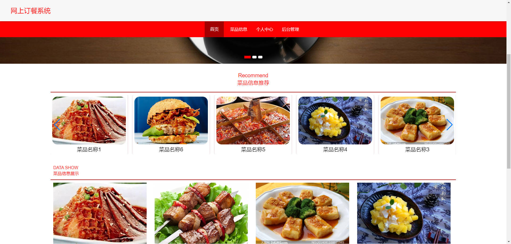

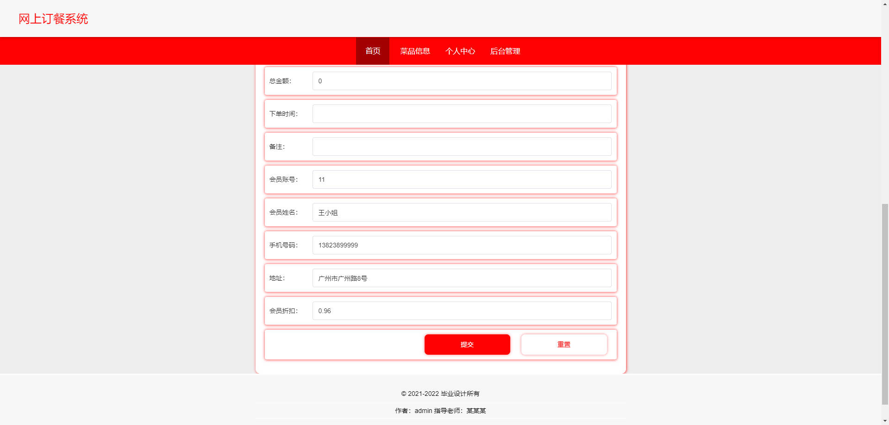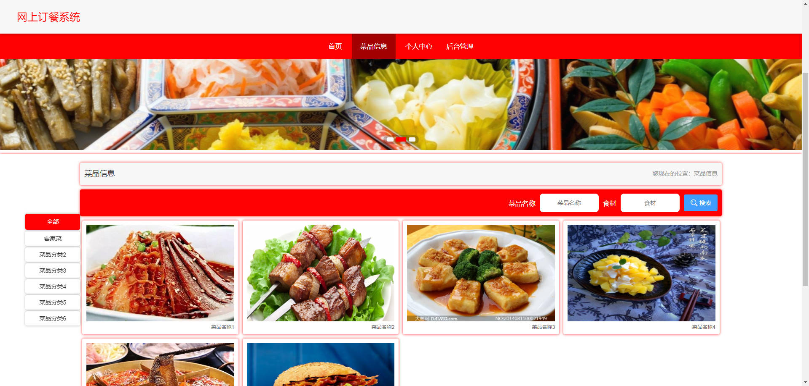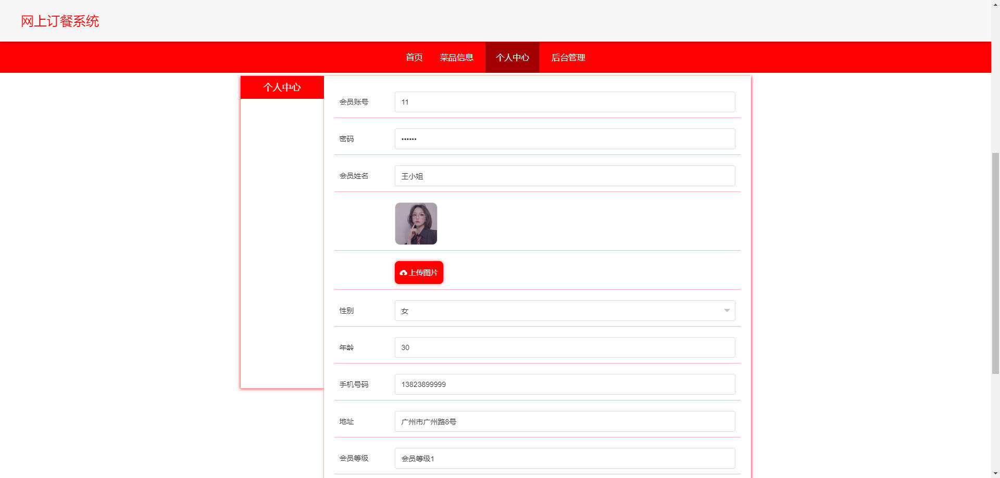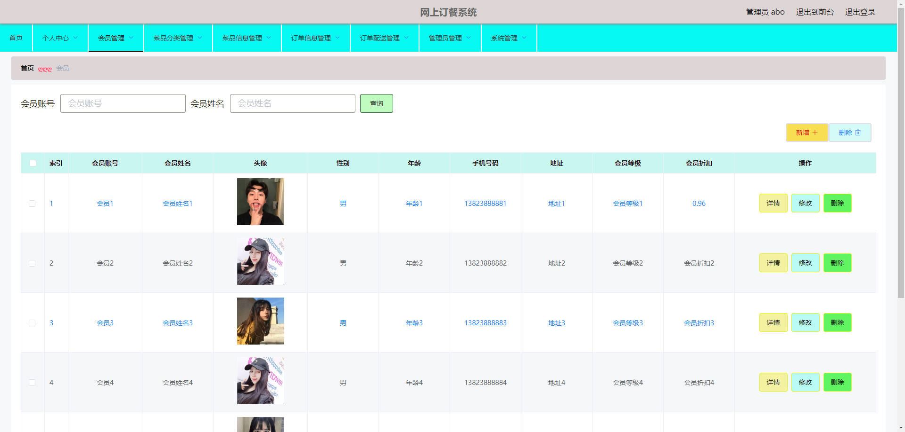

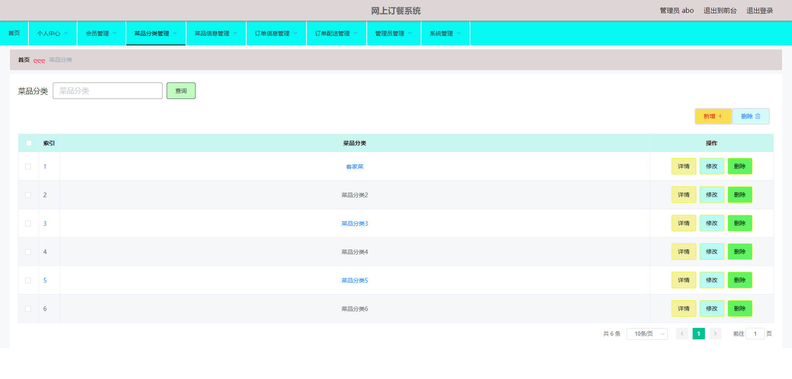

### 后台

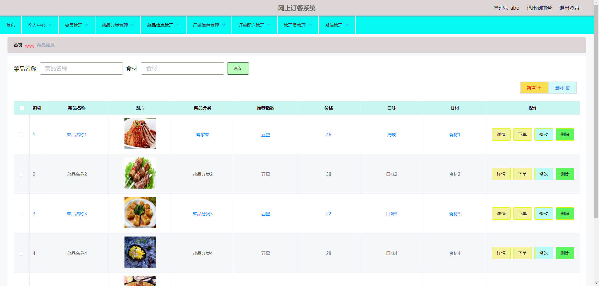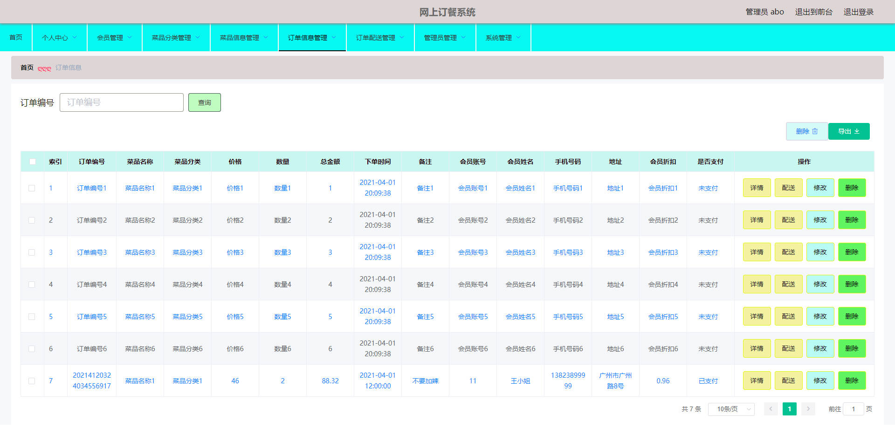

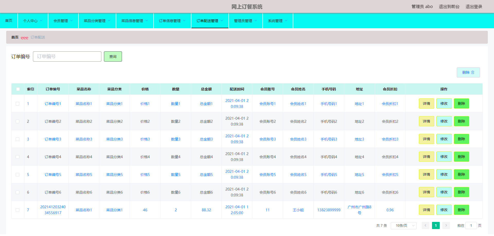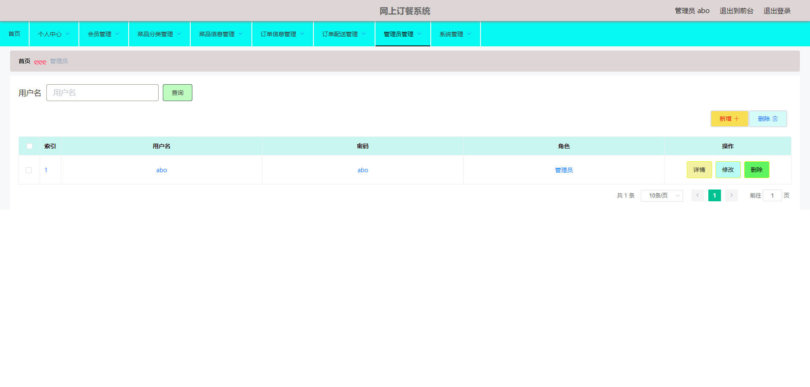

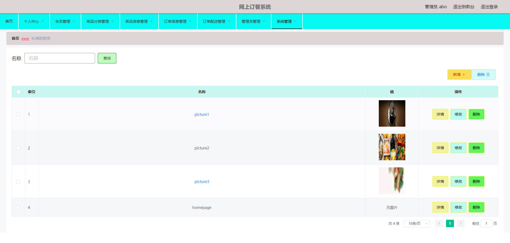

## 访问路径


### 前台

```properties
http://localhost:8080/springboot547vl/front/pages/login/login.html

账号 11
密码 123456
```


### 后台

```properties
http://localhost:8080/springboot547vl/admin/dist/index.html#/login

账号 abo
密码 abo
```


## 功能图

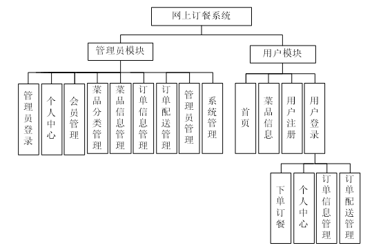


## 文档目录


## 打赏或交流


